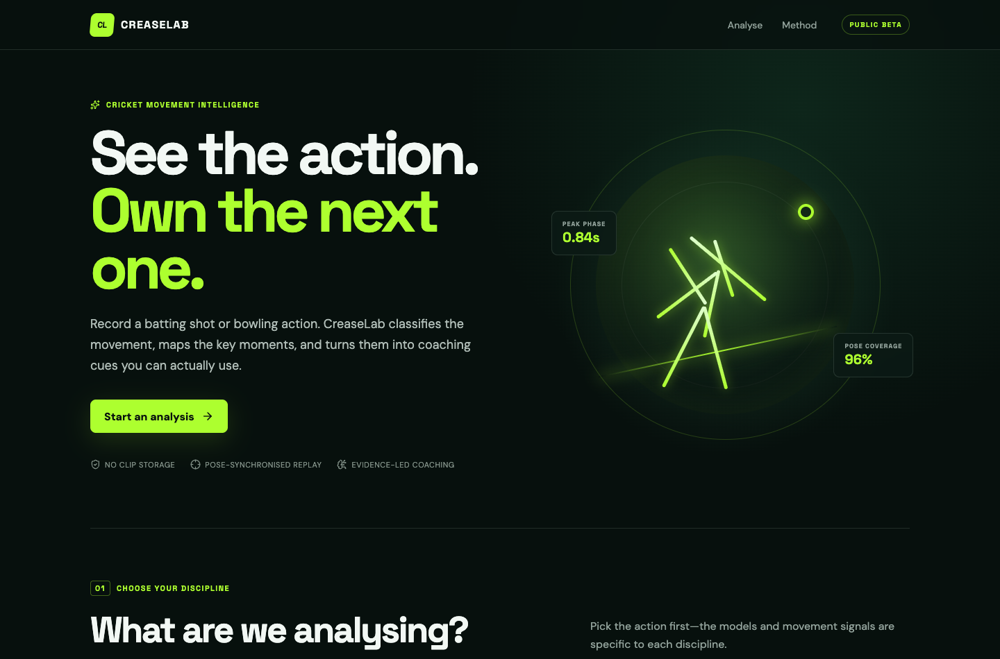
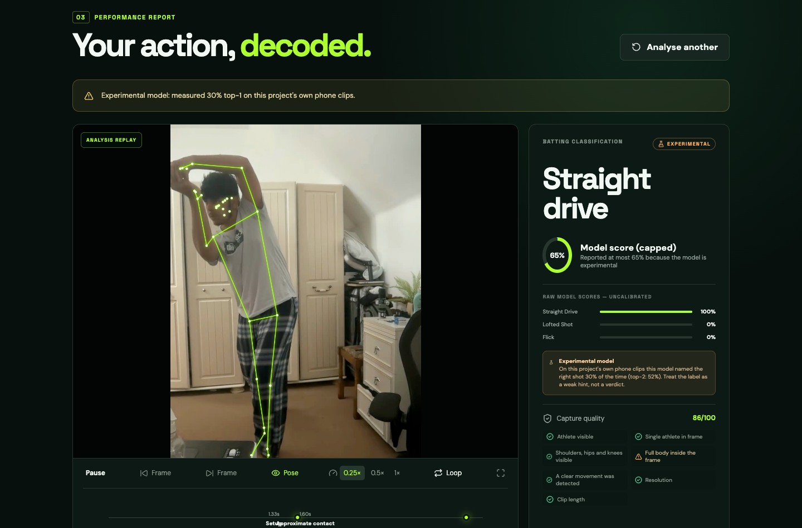
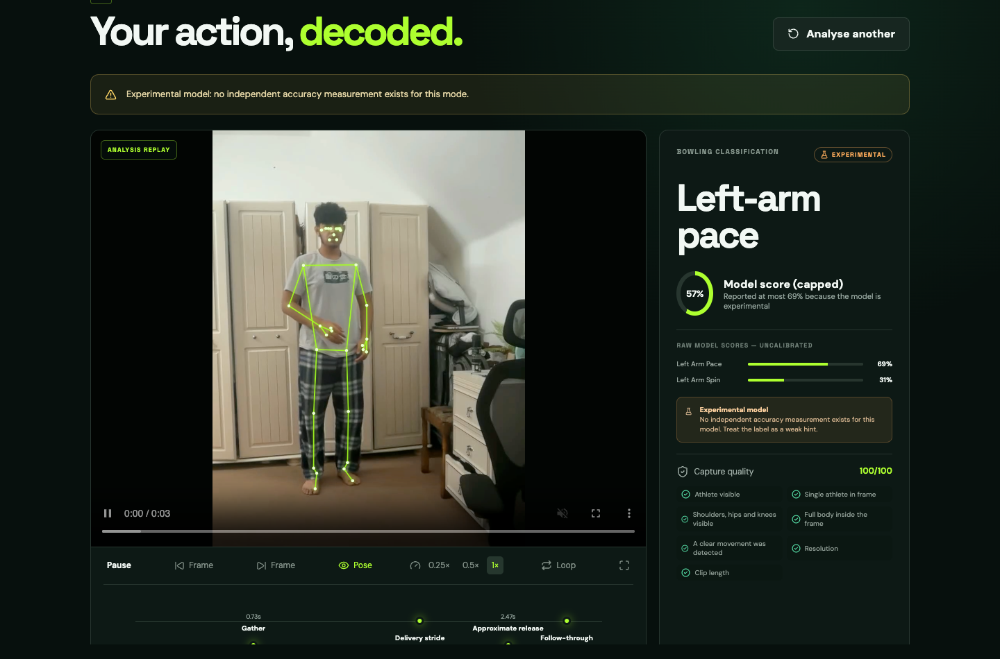
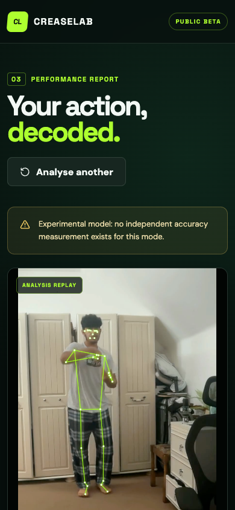

# CreaseLab — cricket movement intelligence

Record a batting shot or a bowling action. CreaseLab classifies the movement,
maps its key phases, measures pose-derived biomechanics, and turns the result
into coaching cues — all grounded in a synchronised replay of **your own clip**.

A web application (React + FastAPI + MediaPipe + ONNX Runtime) that replaces the
earlier PyQt prototype. There is no Azure, no desktop app, no training screens,
and **no bowling-legality judgement** anywhere in the product.

| Landing | Results with synchronised replay |
| --- | --- |
|  |  |

| Bowling (experimental family) | Mobile layout |
| --- | --- |
|  |  |

Screenshots are produced by the automated browser QA run (`npm run qa`), so they
always match the current build.

## What it does

- Choose **batting** or **bowling**, record a clip in the browser, or upload one.
- The replay of the original clip is the centrepiece: pose overlay, slow motion
  (0.25×/0.5×/1×), frame stepping, phase markers, and seekable metric cards.
- Batting: seven shot classes from a trained pose model, **clearly marked
  experimental** (see below), plus hand-speed timing, shoulder rotation, knee
  flexion, head movement and finish position.
- Bowling: six action classes (left/right-arm pace, off spin, leg spin) from a
  trained pose model, with detected bowling arm, release height and reach,
  shoulder rotation, torso lean, and neutral elbow-angle statistics.
- A capture-quality gate that refuses to label poor footage and explains how to
  re-record.
- Evidence-grounded coaching: deterministic by default, optionally enhanced by
  OpenAI with three selected stills. Every claim must cite a measurement.
- Clips are processed in a temporary directory and **deleted**; nothing is
  stored, shared, or used for training.

## Honest about the models

Both production models are **trained in this repository on this project's own
clips**, and both are evaluated the only way that is meaningful for footage
recorded in a handful of sessions: **leave-one-recording-session-out**.

| | Batting | Bowling |
| --- | --- | --- |
| Classes | cut, drive, flick, pull, sweep, reverse sweep, scoop | left/right-arm pace, off spin, leg spin |
| Honest accuracy | **29.2%** | **56.5%** |
| On classes present in training | 42.4% | 72.2% |
| Random-split accuracy (leakage, reference only) | 66.7% | 75.7% |
| Training data | 48 clips, 3 sessions | 46 clips, 2 sessions |
| Displayed confidence cap | 0.60 | 0.75 |

Why the numbers look modest, and why they are still the ones to trust:

* Clips from one session are near-duplicates. A random split puts near-identical
  footage on both sides and reports ~65–75% — that is the figure the earlier
  Random Forest baseline advertised (74.8% CV / 85.7% holdout). It is leakage.
* Some classes were only recorded in one session (scoop and sweep), so when that
  session is held out no model can predict them. The raw figure counts them; the
  "classes present in training" figure does not. Both are published.
* 48 and 46 clips are far too few for general shot recognition. These models are
  a measured baseline for one athlete and one camera setup, and they are labelled
  experimental in the API and the UI.

**The published broadcast video model is no longer used.** It scored 29.6% top-1
on these clips (chance 10%), collapsed onto `straight_drive` for 37 of 44 clips,
and was *more* confident when wrong. Two causes were found: an upstream
preprocessing bug (the graph expects 0–255 input, their demo feeds 0–1) and a
genuine domain mismatch that pose-guided cropping, action-window sampling and
flip averaging could not fix. It is kept in the repository for comparison and
benchmarked by `research/evaluation/batting_benchmark.py`, but the API does not
load it.

Pose features replaced pixel features because they normalise away framing,
background and camera differences — exactly what broke the video model — and
because they improve when more data is added, while frozen broadcast weights
cannot. The full write-up, checksums, per-class recall and upgrade path live in
[`data/models/MODEL_CARD.md`](data/models/MODEL_CARD.md).

## Architecture

```text
Browser (React + Vite)                     FastAPI service (Docker, Render)
┌──────────────────────────┐  POST /api/v1/analyze   ┌───────────────────────────┐
│ Landing / mode selection │ ───────────────────────▶ │ upload validation         │
│ Record (MediaRecorder)   │                          │  ├ size/type/signature    │
│  or upload               │                          │  └ duration limit (12 s)  │
│ Results + replay overlay │                          │ pose extraction (MediaPipe)│
│  canvas sync, phases,    │                          │ quality gate               │
│  metrics, coaching       │ ◀─────────────────────── │ phase detection            │
└──────────────────────────┘  versioned JSON result   │ classification (ONNX/pose) │
                                                      │ biomechanics metrics       │
                                                      │ coaching (rules or OpenAI) │
                                                      └───────────────────────────┘
```

- `api/` — FastAPI routes, analysis orchestration, coaching.
- `ml/` — ONNX inference adapters and JSON model specs (classes, checksums,
  preprocessing, benchmark).
- `vision/` — MediaPipe pose extraction, biomechanics maths, feature derivation,
  capture-quality gate.
- `research/` — evaluation, training and dataset tooling. **Never imported by
  production.** `research/training/` builds the labelled feature tables, trains
  both models and publishes their specs.
- `frontend/` — React + TypeScript + Vite single-page app.
- `data/models/` — deployable artifacts and their model cards (only these are
  committed; all personal footage is gitignored).

### API

| Endpoint | Purpose |
| --- | --- |
| `GET /health`, `GET /api/v1/health` | Liveness, engine readiness, limits |
| `GET /api/v1/models` | Model cards: classes, experimental status, benchmark, provenance |
| `POST /api/v1/analyze` | Multipart upload (`mode`, `camera_angle`, `use_ai_coach`) → versioned analysis result |

The analysis response is versioned by `schema_version` and includes
classification with top alternatives and an `unknown` flag, capture quality with
per-check detail, four timestamped phases per mode, compact pose landmarks for
the replay overlay, metrics that reference the exact frame they were measured
on, warnings, processing timings, and coaching with a safety disclaimer.
Interactive docs are served at `/docs`.

Limits: 25 MB upload, 12-second clips, MP4/MOV/AVI/WebM/MKV. Uploads are checked
by container signature, not just extension, and every request runs in a
temporary directory that is deleted before the response is returned. The API is
stateless: no accounts, no database, no stored history.

## Privacy

- Clips are processed in a temporary directory and deleted after the response.
- Nothing is written to a database; there are no user accounts.
- The optional AI coach (off by default) sends three selected stills and the
  measured metrics to OpenAI **only** when `OPENAI_API_KEY` is configured and
  the user enables it. The rest of the analysis never leaves the API.
- Model outputs are used for coaching text only; clips are never added to a
  training dataset.

## Local setup

### Backend

```bash
python -m venv .venv && source .venv/bin/activate
pip install -r requirements-api.txt
pip install --no-deps mediapipe==0.10.21
uvicorn api.main:app --reload --port 8000
```

Requires Python 3.12. MediaPipe is installed with `--no-deps` on purpose: its
declared dependencies include `opencv-contrib-python` (needs libGL and clashes
with the headless build), plus jax, jaxlib and matplotlib — about 1 GB of
packages the service never touches. Note also that `opencv-contrib-python` must
never be installed alongside `opencv-python-headless` (their files overwrite each
other), and `protobuf` must stay below 5 for MediaPipe compatibility.

### Frontend

```bash
cd frontend
npm install
npm run dev          # http://localhost:5173, proxies to http://localhost:8000
```

Set `VITE_API_BASE_URL` to point at another API instance if needed
(`frontend/.env`).

### Tests

```bash
pip install -r requirements-dev.txt
python -m pytest tests
```

The suite covers the API contract (validation, limits, cleanup, no-legality
fields), model spec/checksum behaviour, the quality gate, phase generation,
coaching claim validation, and — when `data/raw` is present locally — full
batting and bowling analyses of real clips. Real footage is gitignored, so a
fresh clone skips those tests.

### Browser QA

With the API on `127.0.0.1:8000` and `npm run dev` on `127.0.0.1:5173`:

```bash
cd frontend
python qa/prepare-fixtures.py          # H.264 copies of local clips into /tmp
npm install --no-save playwright       # drives the installed Chrome
npm run qa                             # writes screenshots into ../docs
```

42 checks cover the upload flow, automatic replay, pose-overlay alignment,
phase-marker seeking, metric seeking and joint highlighting, slow motion, frame
stepping, loop, the unplayable-codec fallback, poor-footage guidance, the
bowling contract, mobile stickiness/overflow, and console/network cleanliness.
Fixtures are derived from local footage at run time; the only committed fixture
is a synthetic clip with no person in it.

### Retrain the models

```bash
pip install -r requirements-research.txt

python -m research.training.pose_dataset                       # labelled feature tables
python -m research.training.train_action_model --mode batting  # grouped CV + ONNX export
python -m research.training.train_action_model --mode bowling
python -m research.training.publish_pose_model --mode batting  # write the shipped spec
python -m research.training.publish_pose_model --mode bowling
```

Training prints the leave-one-session-out score next to the leakage-inflated
random-split score so the difference is always visible. Adding data is the way to
improve the models:

```bash
python -m research.training.ingest_dataset --source /path/to/<class>/<clip> --mode bowling
```

### Benchmark the retired broadcast model

```bash
python -m research.evaluation.batting_benchmark
python -m research.evaluation.publish_benchmark
```

Writes `data/evaluation/revamp_batting_benchmark.{json,md}` — the evidence behind
retiring the video model.

## Deploying to Render

The repository is a [Render blueprint](render.yaml):

1. Push this branch to GitHub and create a new blueprint from it in Render.
2. Render builds the FastAPI backend from the `Dockerfile` (multi-stage,
   non-root, ONNX Runtime only — no training frameworks) and the frontend from
   `frontend/` as a static site with SPA rewrites.
3. Set `OPENAI_API_KEY` (optional) in the backend service's environment.
4. After the first deploy, confirm that `VITE_API_BASE_URL` and `CORS_ORIGINS`
   still match the actual `.onrender.com` names, then redeploy.

Free-tier notes: the API keeps a single worker so models load once; expect a
cold start of roughly a minute after idle, and warm analyses of ~5–20 s
depending on clip length.

**Memory, measured in the built image** (`docker exec … cat /sys/fs/cgroup/memory.peak`):

| State | RSS |
| --- | --- |
| Idle with both models loaded | ~190 MB |
| Peak during a 3-second batting analysis | ~740 MB |

MediaPipe pose extraction is a fixed ~400 MB of that, and ONNX Runtime would add
another ~310 MB if its CPU arena were left enabled (`enable_cpu_mem_arena` is off
in `ml/video_classifier.py`; it costs about 2% latency and saves a third of a
gigabyte). Because of this the blueprint requests a 1 CPU / 2 GB instance rather
than pretending the 512 MB free tier fits. If you must use free, expect OOM
failures on longer clips.

Local container test:

```bash
docker build -t creaselab-api .
docker run --rm -p 8000:8000 creaselab-api
```

On Apple Silicon add `--platform linux/amd64`: MediaPipe publishes no arm64
Linux wheels, and Render runs amd64.

## Known limitations

- Batting labels are experimental and wrong more often than right on phone
  footage; the UI says so next to every result.
- Bowling classification is a pose heuristic for pace vs spin only.
- Pose metrics come from a single camera and are approximate; there is no true
  ball tracking, no ball-speed estimate, and no injury or legality assessment.
- One athlete is assumed; a second person in frame degrades tracking (the
  quality gate warns when it detects this).
- Browsers cannot decode every codec OpenCV can (MPEG-4 Part 2 and HEVC are the
  usual offenders). The results page detects this and explains it instead of
  showing a broken player; the analysis itself is unaffected.
- No user accounts, saved history, PDF reports, or native mobile app yet.

## Attribution and licensing

- Batting weights: [RITIK-12/CricketShotClassification](https://github.com/RITIK-12/CricketShotClassification),
  MIT. Training data announced as CricShotClassify (Sen et al., *Sensors*
  21(8):2846, 2021); redistribution and commercial-use terms are **unverified**.
  Treat the model as a research/demo baseline.
- Pose model: MediaPipe Pose Landmarker Lite (Apache-2.0).
- The application code in this repository is yours to license as you choose; the
  bundled model artifacts keep the terms described in
  [`data/models/MODEL_CARD.md`](data/models/MODEL_CARD.md).

## Project status

v2.0 — web application replacing the desktop prototype. Bowling-family naming
and the batting shot label are experimental; the replay, phases, metrics and
quality gate are production-grade.
